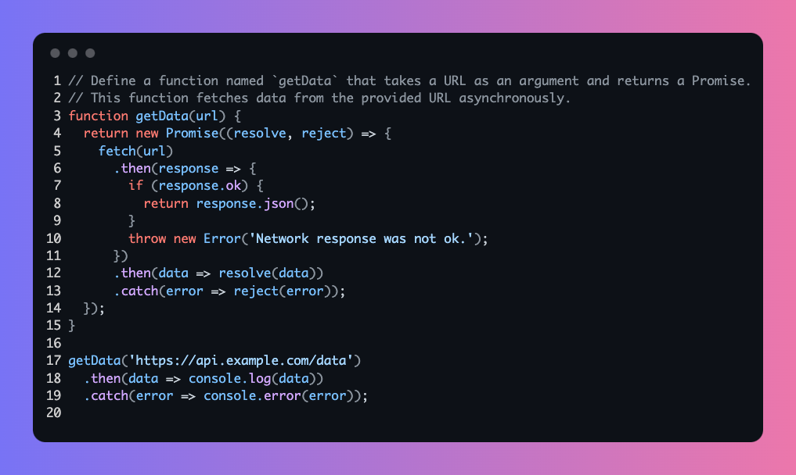

# Codechic - Create Beautiful Code Snippets

**Codechic** is a modern online tool designed to help developers create and share beautiful code snippets. Codechic offers various customization options to effortlessly transform your code into visually appealing images.

## Key Features

- **Various Themes and Color Schemes**  
  Choose from a range of theme styles and color schemes that suit your code, making your snippets look more professional.

- **Code Highlighting**  
  Supports syntax highlighting for multiple programming languages, ensuring your code is visually clear and readable.

- **Customizable Styles**  
  Adjust styles such as font, background, and borders to match your personal style or brand image.

- **Real-Time Preview**  
  Preview the appearance of your code snippet in real time, making sure every adjustment meets your expectations.

- **High-Resolution Export**  
  Export your code snippet as a high-resolution image, suitable for social media, blog posts, or other documents.

## VS Code Extension - Open in CodeChic

To enhance your development workflow, we also offer a VS Code extension called **"Open in CodeChic"**. This extension allows you to send selected code snippets directly from VS Code to Codechic to create beautiful code images.

### Key Features

- **Context Menu Integration**  
  Select a code snippet in VS Code, right-click to see the "Open in CodeChic" option.

- **Automatic Codechic Opening**  
  Clicking this option will automatically open Codechic in your browser and paste the selected code snippet into the editor.

### How to Install and Use

1. **Install the Extension**  
   Open VS Code, go to the Extensions view (shortcut `Ctrl+Shift+X`), search for **"Open in CodeChic"**, and install it.

2. **Select Code Snippet**  
   Select the code snippet you want to beautify in your code file.

3. **Open Codechic**  
   Right-click the selected code snippet and choose **"Open in CodeChic"** from the context menu.

4. **View and Edit**  
   Your browser will automatically open Codechic with the selected code snippet pasted into the editor, where you can continue to style and customize it.

## Example

Here is an example of a code snippet created using Codechic:

  <!-- Replace with an actual example image link -->

## Conclusion

Codechic is a powerful tool for anyone who needs to beautify code snippets. With the VS Code extension, you can efficiently send code snippets directly to Codechic for processing. Whether for personal projects or sharing with the community, Codechic helps you showcase your code in the best possible light.

Visit [Codechic](https://codechic.vercel.app/) to start creating your code snippets or install the **"Open in CodeChic"** extension from the [VS Code Marketplace](https://marketplace.visualstudio.com/) to enhance your development experience!
